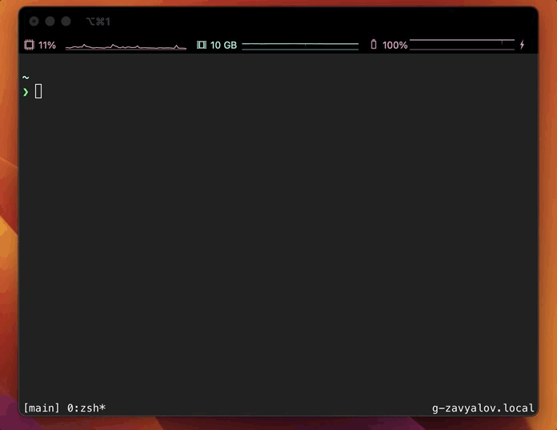

# Snippet Manager CLI

## Demo




## Usage


```console

OVERVIEW: Tool for managing your snippets

USAGE: snpm <subcommand>

OPTIONS:
  --version               Show the version.
  -h, --help              Show help information.

SUBCOMMANDS:
  find (default)          Search for snippet
  new                     Create new snippet
  add                     Add file to snippet
  edit                    Edit snippet
  all                     List of all snippets

  See 'snpm help <subcommand>' for detailed help.

```


## Installation

```console
foo@bar:~$ git clone https://github.com/g-zavyalov/SNPM
foo@bar:~$ cd SNPM
foo@bar:~$ sh install.sh
foo@bar:~$ sh completions.sh
```
